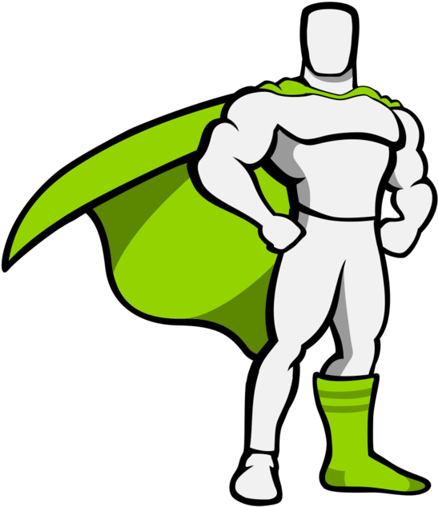

  

  
  

    
  

<h1 align="center">
  hey there
  
</h1>

  

:man_technologist: About Me :I am a Full Stack Developer  from USA.
- :telescope: I’m working as a freelancer Software Engineer and contributing to frontend and backend for building web applications.

- :seedling: Exploring Technical Content Writing.

- :zap: In my free time, I solve problems on GeeksforGeeks and read tech articles.

- :mailbox:How to reach me: 
- ### :hammer_and_wrench: Languages and Tools :
- 

  &nbsp;
  &nbsp;
  &nbsp;
  &nbsp;
  &nbsp;
  &nbsp;
  &nbsp;
  &nbsp;
  &nbsp;
  &nbsp;
  &nbsp;
  &nbsp;
  &nbsp;
  &nbsp;
  
   
   
    
  
  
  
  
  
  
  
  

 :fire: My Stats :
 
 ]
 

<!--
**sbolotnikov/sbolotnikov** is a ✨ _special_ ✨ repository because its `README.md` (this file) appears on your GitHub profile.

Here are some ideas to get you started:

- 🔭 I’m currently working on ...
- 🌱 I’m currently learning ...
- 👯 I’m looking to collaborate on ...
- 🤔 I’m looking for help with ...
- 💬 Ask me about ...
- 📫 How to reach me: ...
- 😄 Pronouns: ...
- ⚡ Fun fact: ...
-->
